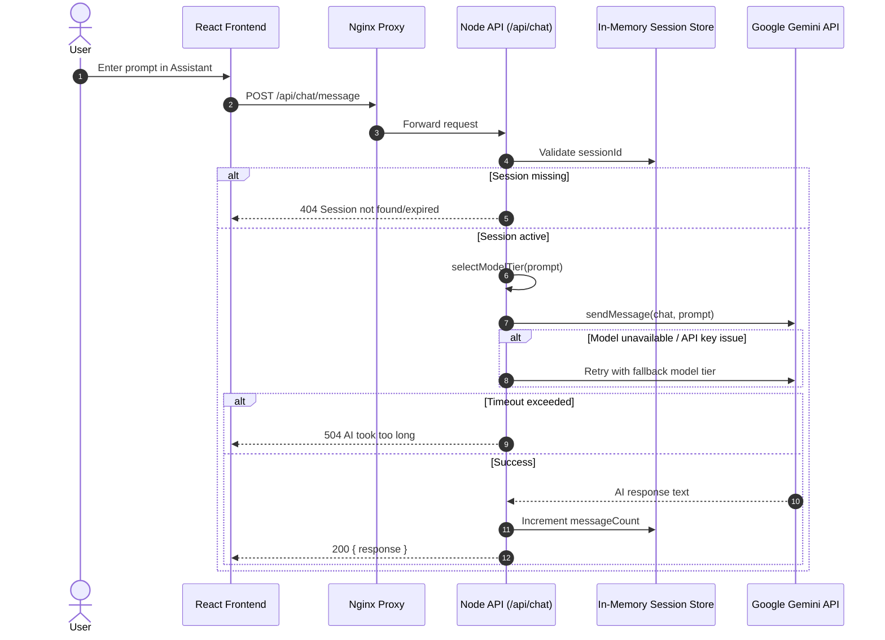
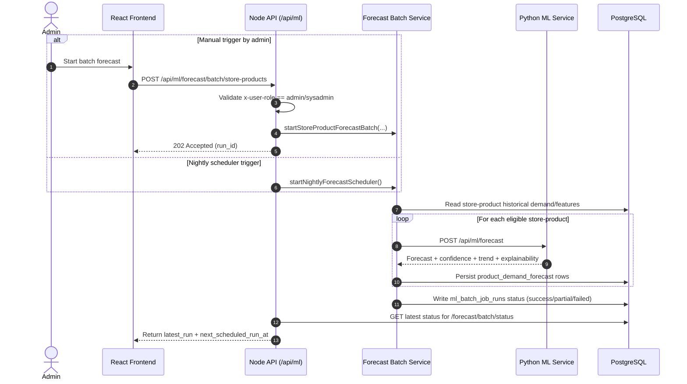

# PODS Detailed Architecture Diagrams

This document provides detailed architecture visualizations for the PODS application.

## 1) System / Container Architecture

```mermaid
flowchart TB
  %% ===== Clients =====
  U1[Store Manager]
  U2[Logistics Analyst]
  U3[Regional Admin]
  U4[System Admin]
  B[Browser SPA]

  U1 --> B
  U2 --> B
  U3 --> B
  U4 --> B

  %% ===== Edge / Web =====
  B --> NGINX[Nginx Reverse Proxy :80]
  NGINX --> FE[React Frontend\n(Vite build served by Nginx)]
  NGINX --> API[Node.js Express API :3001\n(/api/*)]

  %% ===== Backend internals =====
  subgraph BACKEND[Backend Service (TypeScript / Express)]
    SEC[Security Middleware\nheaders + sanitize]
    CORS[CORS + Body Parser]
    RL[Rate Limiters\napiLimiter / mlLimiter / strictLimiter]
    ROUTES[Routes\n/auth /chat /anomalies /data /users /ml]
    CHAT[Gemini Service\nsession chat + SSE stream]
    MLGW[ML Gateway\nproxy to Python service]
    BATCH[Nightly Forecast Scheduler\n+ manual batch trigger]
    DBS[DB Access Layer]
  end

  API --> SEC --> CORS --> RL --> ROUTES
  ROUTES --> CHAT
  ROUTES --> MLGW
  ROUTES --> DBS
  BATCH --> DBS
  BATCH --> MLGW

  %% ===== External AI =====
  CHAT --> GEMINI[Google Gemini API]

  %% ===== ML service =====
  subgraph MLSVC[Python FastAPI ML Service :5000]
    MLR[ML Routes\n/health /info /anomalies/detect /forecast /batch-analysis]
    AD[Isolation Forest\nAnomaly Detection]
    FC[Exponential Smoothing\nDemand Forecasting]
  end

  MLGW --> MLR
  MLR --> AD
  MLR --> FC

  %% ===== Data layer =====
  subgraph PG[PostgreSQL :5432]
    T1[(products)]
    T2[(product_demand_history)]
    T3[(product_demand_features)]
    T4[(product_demand_forecast)]
    T5[(ml_batch_job_runs)]
    T6[(forecast_review_decisions)]
    T7[(freight_routes + freight_route_rates)]
    T8[(users)]
    T9[(audit_logs)]
  end

  DBS --> PG
  MLSVC --> PG

  %% ===== Ops =====
  subgraph OPS[Docker Compose Runtime]
    SEED[Seeder Job (optional profile)]
  end
  SEED --> PG
```

## 2) Sequence Diagram — AI Chat Request Flow



## 3) Sequence Diagram — Forecast Batch Run (Admin + Scheduler)



## 4) Deployment View (Docker Compose Ports)

| Component | Container | Internal Port | Host Port |
|---|---|---:|---:|
| Frontend + Nginx | `pods-frontend` | 80 | 80 / 8080 |
| Node Backend | `pods-backend` | 3001 | 3001 |
| Python ML Service | `pods-ml-service` | 5000 | 5001 |
| PostgreSQL | `pods-postgres` | 5432 | 5432 |

## 5) Rendering Tips

- GitHub, GitLab, and many Markdown viewers render Mermaid blocks directly.
- In VS Code, install a Mermaid-capable Markdown preview extension for live rendering.
- For presentation decks, export Mermaid diagrams to SVG/PNG using Mermaid CLI.
