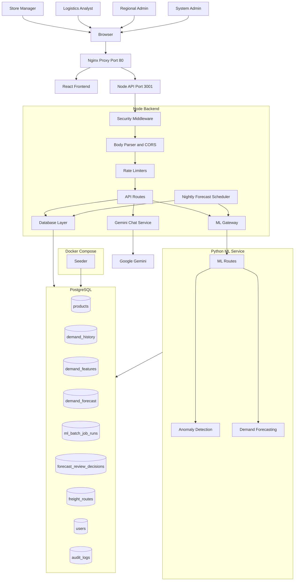
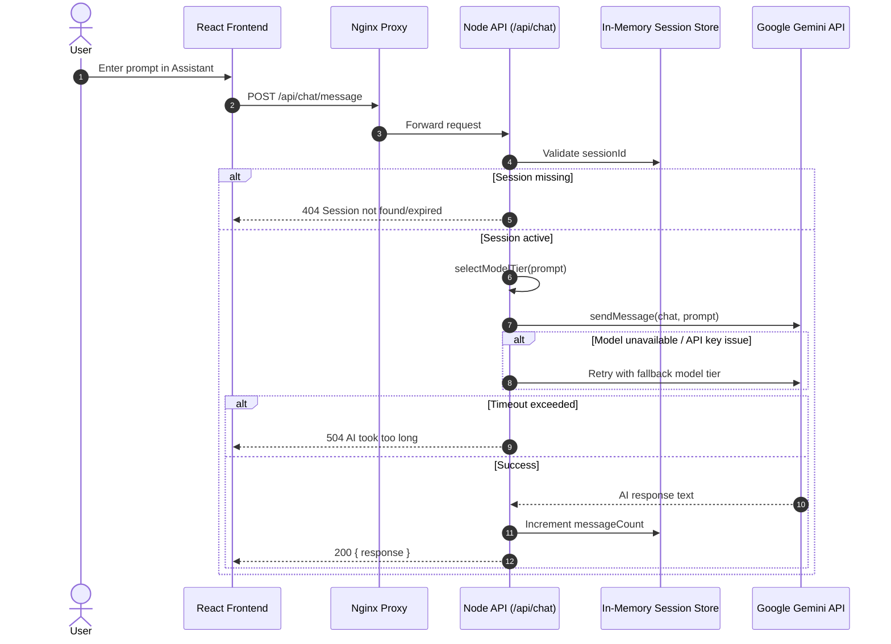
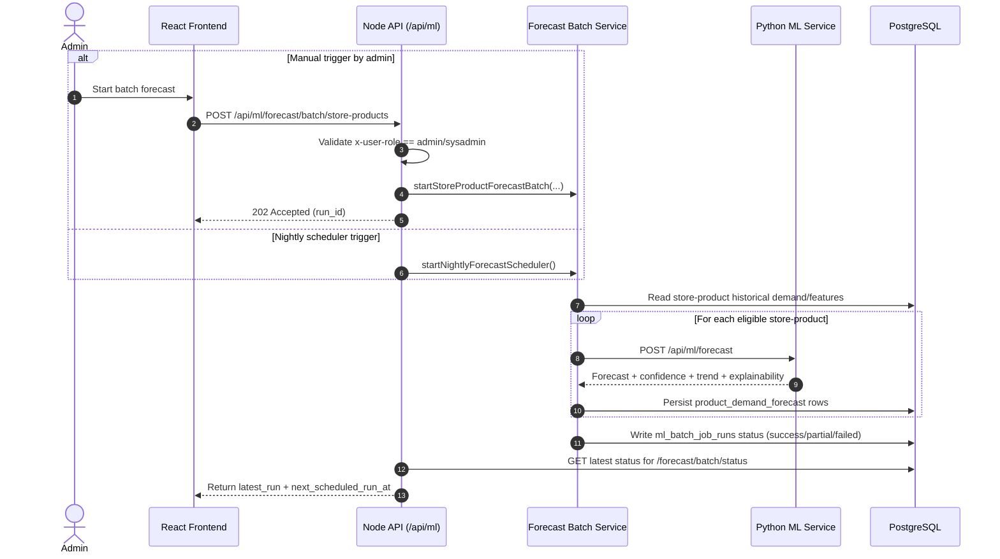
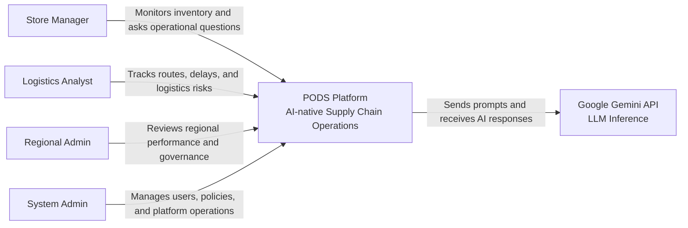
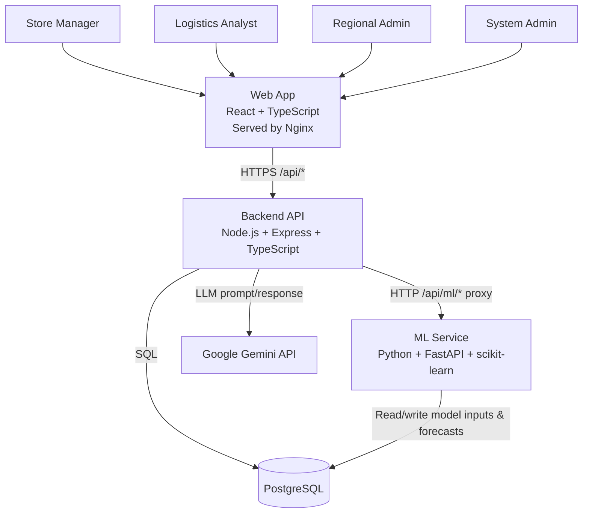
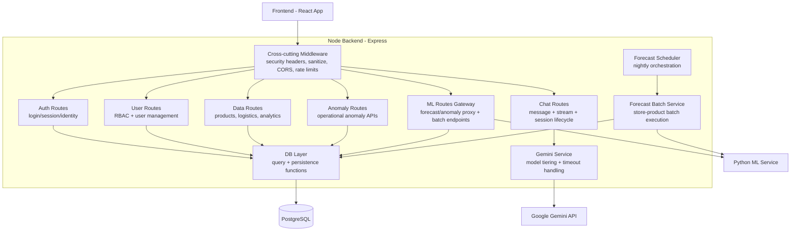

# PODS Detailed Architecture Diagrams

This document provides detailed architecture visualizations for the PODS application.

## 1) System / Container Architecture

## 2) Sequence Diagram — AI Chat Request Flow

## 3) Sequence Diagram — Forecast Batch Run (Admin + Scheduler)

## 4) Deployment View (Docker Compose Ports)

| Component | Container | Internal Port | Host Port |
|---|---|---:|---:|
| Frontend + Nginx | `pods-frontend` | 80 | 80 / 8080 |
| Node Backend | `pods-backend` | 3001 | 3001 |
| Python ML Service | `pods-ml-service` | 5000 | 5001 |
| PostgreSQL | `pods-postgres` | 5432 | 5432 |

## 5) Rendering Tips

- GitHub, GitLab, and many Markdown viewers render Mermaid blocks directly.
- In VS Code, install a Mermaid-capable Markdown preview extension for live rendering.
- For presentation decks, export Mermaid diagrams to SVG/PNG using Mermaid CLI.

## 6) C4 Level 1 — System Context

## 7) C4 Level 2 — Container Diagram

## 8) C4 Level 3 — Component Diagram (Node Backend)

